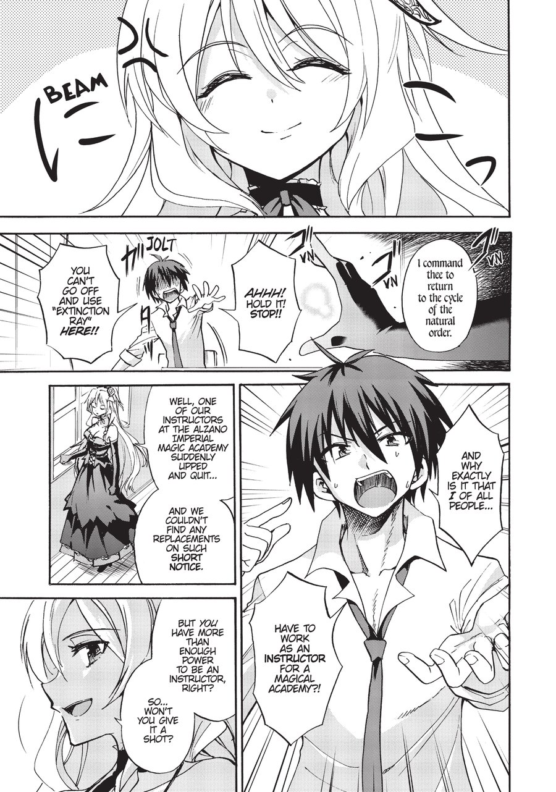
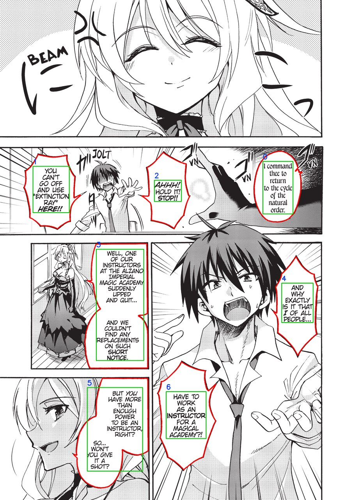
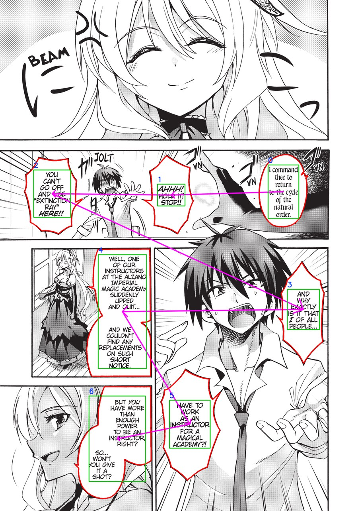
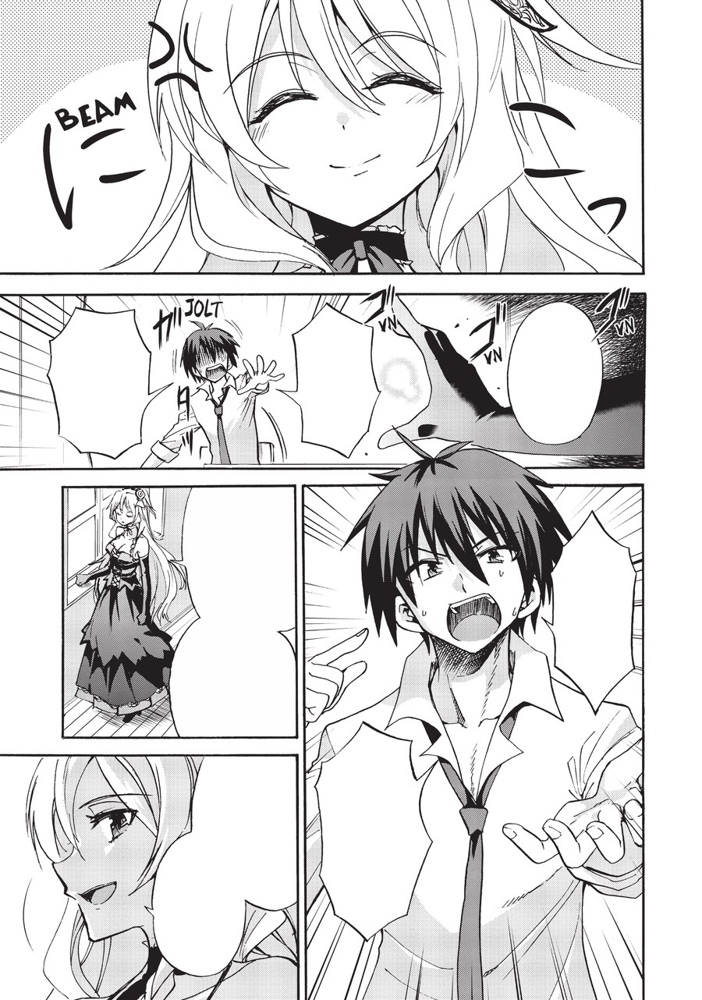

# ScanTrad

**ScanTrad est un SaaS de traduction de mangas** : l'utilisateur dépose un
chapitre sur le site, le fait traduire, et le lit directement dans le
navigateur. Au cœur du service, un pipeline détecte les bulles de texte d'une
planche, en traduit le contenu et efface le texte d'origine pour le remplacer.

> **Où en est le projet :** le pipeline de traitement d'image (backend, C#), le
> moteur du SaaS, est fonctionnel et testé sur planche réelle. L'API et le site
> ne sont pas encore écrits — voir la [Feuille de route](#feuille-de-route).

## Aperçu

Sur une planche réelle (`Akashic.jpg`), sans aucune retouche manuelle :

| 1. Planche d'origine | 2. Détection des blocs |
|:---:|:---:|
|  |  |
| **3. Ordre de lecture reconstruit** | **4. Bulles nettoyées** |
|  |  |

- **Détection** — vert : rectangle du bloc de texte · rouge : contour de la
  bulle reconstruit · bleu : rang.
- **Ordre de lecture** — le chemin magenta relie les blocs dans l'ordre où un
  lecteur les lirait, calculé automatiquement.
- **Nettoyage** — chaque bulle est repeinte avec la couleur de fond mesurée en
  son intérieur, prête à recevoir le texte traduit.

Ces quatre images sont produites par la suite de tests elle-même (voir
[Tests](#tests)) : ce ne sont pas des captures retouchées, mais l'état réel du
pipeline à chaque étape.

## Le principe

1. **Déposer** une planche (à terme, un chapitre entier) sur le site.
2. **Détecter** les bulles de texte et en extraire le contenu par OCR.
3. **Ordonner** les bulles selon le sens de lecture du manga.
4. **Traduire** le dialogue, au choix, avec plusieurs moteurs (traduction en
   ligne ou modèles exécutés localement).
5. **Nettoyer** chaque bulle pour effacer le texte d'origine.
6. **Composer** le texte traduit dans la bulle nettoyée et **lire** le résultat
   directement dans le navigateur.

Les étapes 2 à 5 sont un pipeline C# indépendant, pensé pour tourner aussi bien
en local que derrière une API — c'est ce que ce dépôt contient aujourd'hui.

## Architecture

```
backend/
├── Api/                 ASP.NET Core — expose le pipeline en service (à écrire)
└── Pipeline/             ScanTrad.Pipeline — tout le traitement d'image
    ├── Abstractions/     Contrats de chaque étape (ILecteurDePlanche, IOrdonnanceurDeZones,
    │                     IEffaceurDeTexte, ITraducteur)
    ├── Models/           Planche · ZoneDeTexte · Bulle · Quadrilatere · Coordonnee
    ├── Lecture/          Détection des blocs (ONNX) + OCR (PaddleOCR) + reconstruction des bulles
    ├── OrdreDeLecture/   Calcul de l'ordre de lecture par découpe récursive de la planche
    ├── Effacement/       Remplissage uni des bulles par la couleur de fond mesurée
    └── Traduction/       Traduction multi-moteurs (OPUS-MT, NLLB-200)
```

Chaque étape est une implémentation d'une interface définie dans
`Abstractions/`, et reçoit/rend un objet **`Planche`** immuable : une étape ne
modifie jamais celle qu'elle reçoit, elle en construit une nouvelle. L'image
d'origine et les résultats intermédiaires coexistent ainsi tout du long, ce qui
permet de corriger une traduction sans rejouer la détection ou l'OCR.

Ce découpage en interfaces est volontairement pensé pour une **Clean
Architecture** côté API : le pipeline ne connaît rien du web, de la base de
données ni du stockage — l'API (à venir) n'aura qu'à l'orchestrer.

## Stack technique

| Domaine | Choix |
|---|---|
| Langage / runtime | C# · .NET 8 |
| Détection de texte | [comic-text-detector](https://github.com/dmMaze/comic-text-detector) (ONNX Runtime) |
| OCR | [PaddleOCR](https://github.com/PaddlePaddle/PaddleOCR) (via Sdcb.PaddleOCR) |
| Traitement d'image | OpenCvSharp (OpenCV) |
| Traduction locale | OPUS-MT (Helsinki-NLP, Marian) · NLLB-200 (Meta), exécutés en ONNX |
| Tests | xUnit v3 |
| API (à venir) | ASP.NET Core, Clean Architecture |
| Front (à venir) | Technologies non arrêtées |

## Feuille de route

**Fait**

- [x] Détection des blocs de texte sur une planche (modèle ONNX)
- [x] OCR à pleine résolution par bloc détecté
- [x] Reconstruction du contour de la bulle et de sa couleur de fond
- [x] Calcul de l'ordre de lecture (découpe récursive de la planche)
- [x] Effacement du texte par remplissage uni de la bulle
- [x] Moteurs de traduction OPUS-MT et NLLB-200

**En cours / à venir**

- [ ] Rendu du texte traduit dans la bulle nettoyée (composition finale)
- [ ] Inpainting pour les bulles tramées ou en dégradé, où le remplissage uni
      se voit
- [ ] Détection des cases, pour lever l'ambiguïté restante sur l'ordre de
      lecture entre deux bulles très écartées dans une même case haute
- [ ] Configuration externalisée des emplacements de modèles (actuellement des
      chemins codés en dur, propres à la machine de développement)
- [ ] API ASP.NET Core exposant le pipeline (Clean Architecture)
- [ ] Front web — dépôt d'un chapitre, lecture, choix du moteur de traduction
- [ ] Détection des onomatopées et des cases dans le décor (hors bulle)

## Installation

### Prérequis

- **Windows x64** — les runtimes natifs utilisés aujourd'hui
  (`OpenCvSharp4.runtime.win`, `Sdcb.PaddleInference.runtime.win64.mkl`) sont
  spécifiques à Windows. Porter le pipeline sur Linux/macOS suppose de changer
  ces deux paquets pour leurs équivalents multiplateformes.
- [.NET SDK](https://dotnet.microsoft.com/download) — un `global.json` fixe la
  version utilisée et s'adapte automatiquement au SDK installé.
- Environ **1,5 Go** d'espace disque libre pour le modèle de détection et les
  paquets NuGet (bien plus si vous installez aussi les moteurs de traduction
  locaux, voir plus bas).

### 1. Cloner et restaurer

```bash
git clone https://github.com/Freckyjules/ScanTrad.git
cd ScanTrad/backend
dotnet restore ScanTrad.sln
```

### 2. Récupérer le modèle de détection de texte

Le modèle `comictextdetector.onnx` (≈ 95 Mo) n'est **pas versionné** dans le
dépôt : il est indispensable à la lecture d'une planche et aux tests
d'intégration, mais trop volumineux pour Git.

1. Télécharger le fichier `comictextdetector.onnx` depuis
   [HighLiuk/japanese-onnx-models](https://huggingface.co/HighLiuk/japanese-onnx-models)
   (ou toute autre distribution du modèle
   [comic-text-detector](https://github.com/dmMaze/comic-text-detector)).
2. Le placer dans `backend/modeles/comictextdetector.onnx`.

Sans ce fichier, la lecture d'une planche et les tests d'intégration échouent
avec un message qui rappelle où le déposer.

### 3. (Optionnel) Moteurs de traduction locaux

Les moteurs OPUS-MT et NLLB-200 s'appuient eux aussi sur des modèles exportés
localement, non versionnés (520 Mo et 6,9 Go respectivement). Leurs mémos de
génération sont dans `backend/Pipeline/Traduction/Moteurs/OpusMt/OPUS-MT.md` et
`.../Nllb/NLLB-200.md`. Sans eux, tout le pipeline reste utilisable — seule la
traduction n'est pas disponible.

### 4. Compiler

```bash
dotnet build ScanTrad.sln
```

## Tests

```bash
cd backend

# Tests unitaires uniquement (rapides, aucun modèle requis)
dotnet test PipelineTests/PipelineTests.csproj --filter-not-trait "Categorie=Integration"

# Suite complète, y compris les tests sur planche réelle (nécessite le modèle
# de détection ci-dessus ; compte une vingtaine de secondes de chargement)
dotnet test PipelineTests/PipelineTests.csproj
```

Les tests sur planche réelle ne vérifient pas qu'une détection est *juste* —
il faut la regarder. C'est le rôle des images ci-dessus : elles sont attachées
au résultat de ces tests et déposées automatiquement (dans
`backend/TestResults/`), pour qu'un humain les inspecte plutôt que de faire
confiance à une assertion.

> Sans les modèles de traduction locaux (étape 3 de l'installation), les tests
> `TraductionNllbTests` et `TraductionOpusMtTests` échouent avec un
> `FileNotFoundException` explicite — c'est attendu, et sans effet sur le
> reste de la suite.

## Licence

Tous droits réservés. Ce dépôt est public à titre de démonstration ; il n'est
pas distribué sous licence open-source.
