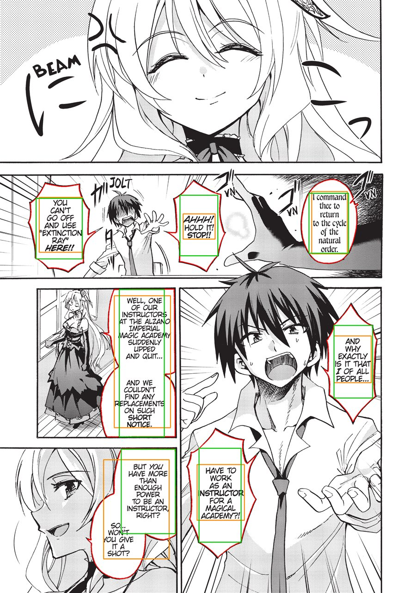
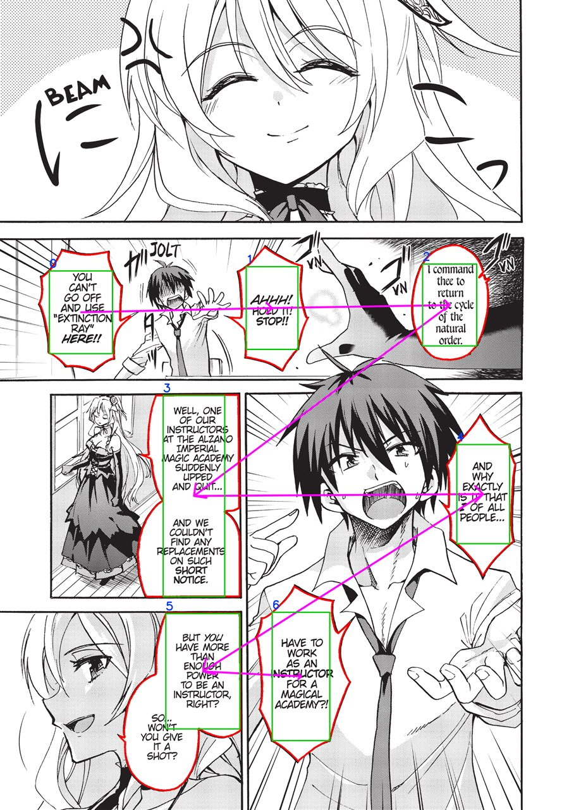
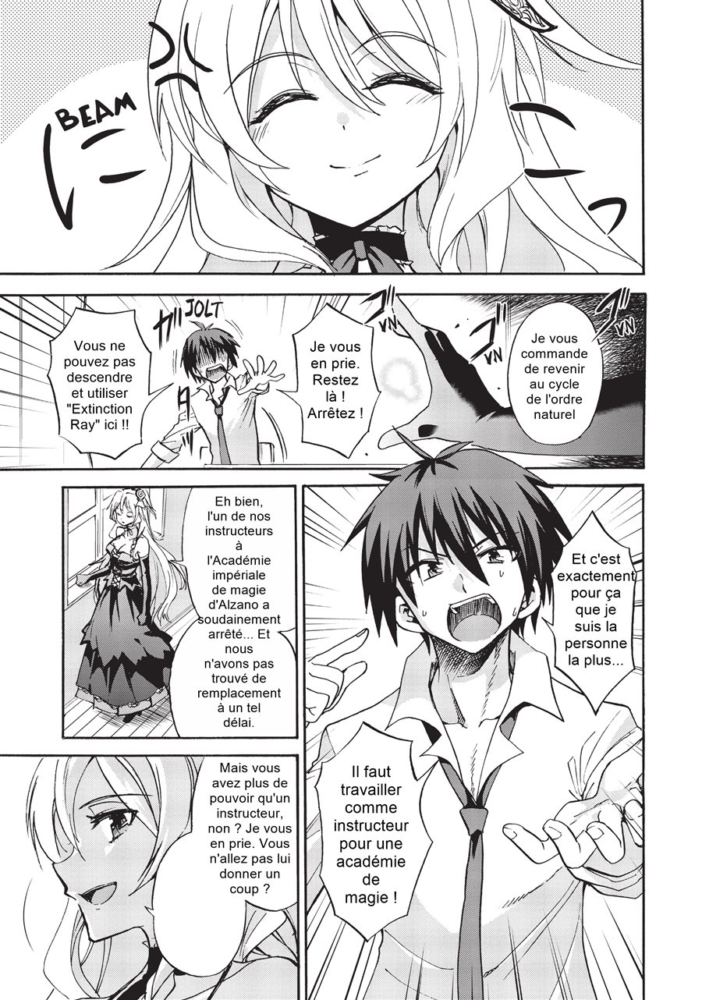

# ScanTrad

**ScanTrad est un SaaS de traduction de mangas** : l'utilisateur dépose un
chapitre sur le site, le fait traduire, et le lit directement dans le
navigateur. Au cœur du service, un pipeline détecte les bulles de texte d'une
planche, en traduit le contenu, efface le texte d'origine et y réécrit la
traduction.

> **Où en est le projet :** le pipeline de traitement d'image (backend, C#),
> le moteur du SaaS, est **complet et fonctionne de bout en bout** sur planche
> réelle — de l'image brute à la planche composée en français. L'API et le
> site ne sont pas encore écrits — voir la [Feuille de route](#feuille-de-route).

## Aperçu

Sur une planche réelle (`Akashic.jpg`), sans aucune retouche manuelle. Ces six
images sont produites par la suite de tests elle-même (voir [Tests](#tests)) :
ce ne sont pas des captures retouchées, mais l'état réel du pipeline à chaque
étape.

<table>
<tr>
<td width="380"></td>
<td>

**1. Planche d'origine**

La planche telle qu'elle arrive, avant tout traitement.

</td>
</tr>
<tr>
<td width="380"></td>
<td>

**2. Détection des blocs**

Vert : rectangle du bloc de texte détecté par le modèle ONNX · rouge : contour
de la bulle reconstruit · bleu : rang de détection.

</td>
</tr>
<tr>
<td width="380"></td>
<td>

**3. Cadrage du rectangle**

Orange : rectangle d'origine — souvent trop étroit sur une bulle isolée, ou,
sur deux bulles collées assemblées en une seule zone, débordant des deux à la
fois. Vert : rectangle maximisé dans le contour rouge de la bulle, sans jamais
le dépasser.

</td>
</tr>
<tr>
<td width="380"></td>
<td>

**4. Ordre de lecture**

Le chemin magenta relie les blocs dans l'ordre où un lecteur les lirait,
calculé automatiquement à partir des rectangles cadrés.

</td>
</tr>
<tr>
<td width="380"></td>
<td>

**5. Nettoyage**

Chaque bulle est repeinte avec la couleur de fond mesurée en son intérieur,
prête à recevoir le texte traduit.

</td>
</tr>
<tr>
<td width="380"></td>
<td>

**6. Composition finale**

Le texte traduit (ici par NLLB-200) est réécrit dans le rectangle cadré de
chaque zone ; sa taille part de celle du texte d'origine et ne réduit que si
la traduction déborde.

</td>
</tr>
</table>

## Le principe

1. **Déposer** une planche (à terme, un chapitre entier) sur le site.
2. **Détecter** les bulles de texte et en extraire le contenu par OCR.
3. **Ordonner** les bulles selon le sens de lecture du manga.
4. **Traduire** le dialogue, au choix, avec plusieurs moteurs (traduction en
   ligne ou modèles exécutés localement).
5. **Nettoyer** chaque bulle pour effacer le texte d'origine.
6. **Composer** le texte traduit dans la bulle nettoyée et **lire** le résultat
   directement dans le navigateur.

Les étapes 2 à 6 (composer excepté) sont un pipeline C# indépendant et complet,
pensé pour tourner aussi bien en local que derrière une API — c'est ce que ce
dépôt contient aujourd'hui. Seule la lecture dans le navigateur (le site)
reste à écrire.

## Architecture

```
backend/
├── Api/                  ASP.NET Core — expose le pipeline en service (à écrire)
└── Pipeline/              ScanTrad.Pipeline — tout le traitement d'image
    ├── Abstractions/      Contrats de chaque étape (ILecteurDePlanche, IAjusteurDeRectangle,
    │                      IOrdonnanceurDeZones, ITraducteur, IEffaceurDeTexte,
    │                      IReecrivainDeTexte, IOrchestrateurDePipeline)
    ├── Models/            Planche · ZoneDeTexte · Bulle · Quadrilatere · Coordonnee
    ├── Lecture/           Détection des blocs (ONNX) + OCR (PaddleOCR) + reconstruction des bulles
    ├── Cadrage/           Maximise le rectangle de chaque zone dans le contour de sa bulle
    ├── OrdreDeLecture/    Calcul de l'ordre de lecture par découpe récursive de la planche
    ├── Traduction/        Traduction multi-moteurs (OPUS-MT, NLLB-200)
    ├── Effacement/        Remplissage uni des bulles par la couleur de fond mesurée
    ├── Reecriture/        Composition finale : texte traduit réécrit dans le rectangle cadré
    ├── Orchestration/     Point d'entrée : enchaîne les six étapes ci-dessus dans l'ordre
    └── LocalisateurDeModele.cs   Emplacement des modèles, lu dans modeles.local.json
```

Chaque étape est une implémentation d'une interface définie dans
`Abstractions/`, et reçoit/rend un objet **`Planche`** immuable : une étape ne
modifie jamais celle qu'elle reçoit, elle en construit une nouvelle (ou, pour
l'ordonnanceur et le traducteur, renseigne directement les zones qu'on lui
donne — voir la documentation de chaque interface). L'image d'origine et les
résultats intermédiaires coexistent ainsi tout du long, ce qui permet de
corriger une traduction sans rejouer la détection ou l'OCR : il suffit de
rejouer `IReecrivainDeTexte`, pas tout l'`Orchestrateur`.

Ce découpage en interfaces est volontairement pensé pour une **Clean
Architecture** côté API : le pipeline ne connaît rien du web, de la base de
données ni du stockage — l'API (à venir) n'aura qu'à construire les six
étapes et les confier à l'`Orchestrateur`.

## Stack technique

| Domaine | Choix |
|---|---|
| Langage / runtime | C# · .NET 8 |
| Détection de texte | [comic-text-detector](https://github.com/dmMaze/comic-text-detector) (ONNX Runtime) |
| OCR | [PaddleOCR](https://github.com/PaddlePaddle/PaddleOCR) (via Sdcb.PaddleOCR) |
| Traitement d'image | OpenCvSharp (OpenCV) |
| Rendu du texte traduit | GDI+ (`System.Drawing.Common`) — les polices Hershey d'OpenCV ne gèrent pas les accents français |
| Traduction locale | OPUS-MT (Helsinki-NLP, Marian) · NLLB-200 (Meta), exécutés en ONNX |
| Tests | xUnit v3 |
| API (à venir) | ASP.NET Core, Clean Architecture |
| Front (à venir) | Technologies non arrêtées |

## Feuille de route

**Fait**

- [x] Détection des blocs de texte sur une planche (modèle ONNX)
- [x] OCR à pleine résolution par bloc détecté
- [x] Reconstruction du contour de la bulle et de sa couleur de fond
- [x] Cadrage : maximisation du rectangle de chaque zone dans sa bulle
- [x] Calcul de l'ordre de lecture (découpe récursive de la planche)
- [x] Moteurs de traduction OPUS-MT et NLLB-200
- [x] Effacement du texte par remplissage uni de la bulle
- [x] Composition finale : réécriture du texte traduit dans le rectangle cadré
- [x] Orchestrateur enchaînant les six étapes — point d'entrée du pipeline
- [x] Configuration des emplacements de modèles externalisée
      (`modeles.local.json`, non versionné)

**En cours / à venir**

- [ ] Inpainting pour les bulles tramées ou en dégradé, où le remplissage uni
      se voit
- [ ] Détection des cases, pour lever l'ambiguïté restante sur l'ordre de
      lecture entre deux bulles très écartées dans une même case haute
- [ ] API ASP.NET Core exposant le pipeline (Clean Architecture)
- [ ] Front web — dépôt d'un chapitre, lecture, choix du moteur de traduction
- [ ] Détection des onomatopées et des cases dans le décor (hors bulle)

## Installation

### Prérequis

- **Windows x64** — les runtimes natifs utilisés aujourd'hui
  (`OpenCvSharp4.runtime.win`, `Sdcb.PaddleInference.runtime.win64.mkl`) sont
  spécifiques à Windows, tout comme le rendu du texte traduit (GDI+). Porter
  le pipeline sur Linux/macOS suppose de changer ces paquets pour leurs
  équivalents multiplateformes.
- [.NET SDK](https://dotnet.microsoft.com/download) — un `global.json` fixe la
  version utilisée et s'adapte automatiquement au SDK installé.
- Environ **1,5 Go** d'espace disque libre pour le modèle de détection et les
  paquets NuGet (bien plus si vous installez aussi les moteurs de traduction
  locaux, voir plus bas).

### 1. Cloner et restaurer

```bash
git clone https://github.com/Freckyjules/ScanTrad.git
cd ScanTrad/backend
dotnet restore ScanTrad.sln
```

### 2. Déclarer l'emplacement des modèles

Aucun modèle n'est versionné dans le dépôt (ils pèsent de quelques centaines
de mégaoctets à plusieurs gigaoctets), et leur emplacement n'est pas codé en
dur : `LocalisateurDeModele` le lit dans `backend/modeles.local.json`, un
fichier non versionné, propre à chaque machine.

1. Copier `backend/modeles.local.json.example` en `backend/modeles.local.json`.
2. Récupérer le modèle `comictextdetector.onnx` (≈ 95 Mo) depuis
   [HighLiuk/japanese-onnx-models](https://huggingface.co/HighLiuk/japanese-onnx-models)
   (ou toute autre distribution du modèle
   [comic-text-detector](https://github.com/dmMaze/comic-text-detector)),
   le déposer où vous voulez, et renseigner son chemin complet dans la clé
   `detecteur` de `modeles.local.json`.

Sans ce fichier, ou sans la clé `detecteur` renseignée, la lecture d'une
planche et les tests d'intégration échouent avec un message qui le rappelle.

### 3. (Optionnel) Moteurs de traduction locaux

Les moteurs OPUS-MT et NLLB-200 s'appuient eux aussi sur des modèles exportés
localement (520 Mo et 6,9 Go respectivement). Leurs mémos de génération sont
dans `backend/Pipeline/Traduction/Moteurs/OpusMt/OPUS-MT.md` et
`.../Nllb/NLLB-200.md`. Une fois exportés, renseigner leur chemin dans les
clés `opusMt` et `nllb` de `modeles.local.json`. Sans eux, tout le pipeline
reste utilisable — seule la traduction n'est pas disponible.

### 4. Compiler

```bash
dotnet build ScanTrad.sln
```

## Tests

```bash
cd backend

# Tests unitaires uniquement (rapides, aucun modèle requis)
dotnet test PipelineTests/PipelineTests.csproj --filter-not-trait "Categorie=Integration"

# Suite complète, y compris les tests sur planche réelle (nécessite le modèle
# de détection ci-dessus ; compte une vingtaine de secondes de chargement)
dotnet test PipelineTests/PipelineTests.csproj
```

Les tests sur planche réelle ne vérifient pas qu'une détection est *juste* —
il faut la regarder. C'est le rôle des images ci-dessus : elles sont attachées
au résultat de ces tests et déposées automatiquement (dans
`backend/TestResults/`), pour qu'un humain les inspecte plutôt que de faire
confiance à une assertion. `OrchestrateurSurPlancheReelleTests` est le plus
complet : il traite `Akashic.jpg` brute de bout en bout, par le point d'entrée
du pipeline, pour les deux moteurs de traduction.

> Sans les modèles de traduction locaux (étape 3 de l'installation), les tests
> qui en dépendent échouent avec un `FileNotFoundException` explicite — c'est
> attendu, et sans effet sur le reste de la suite.

## Licence

Tous droits réservés. Ce dépôt est public à titre de démonstration ; il n'est
pas distribué sous licence open-source.
